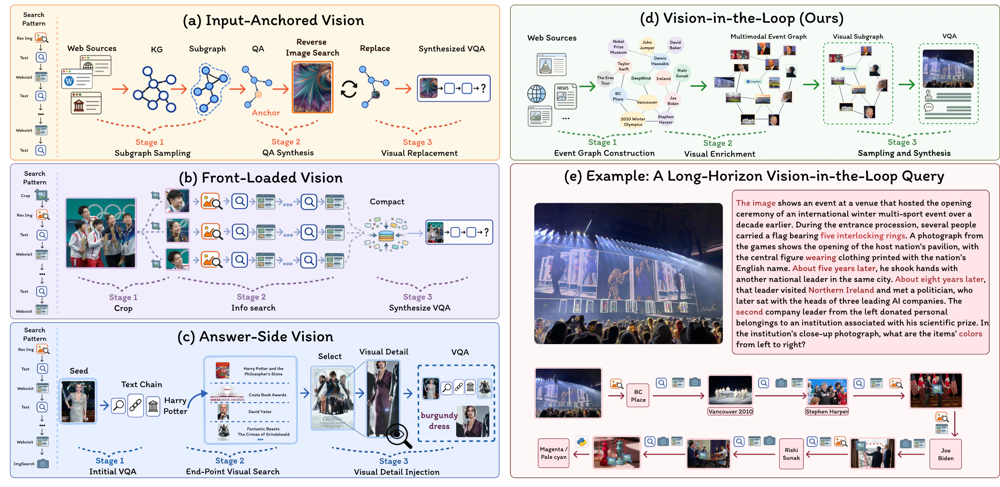
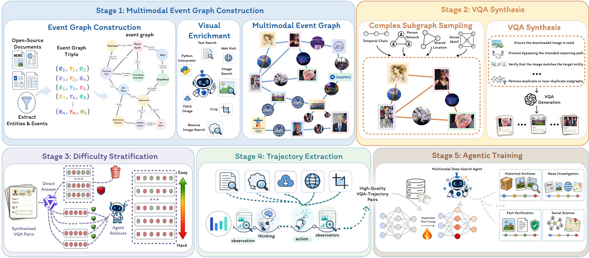
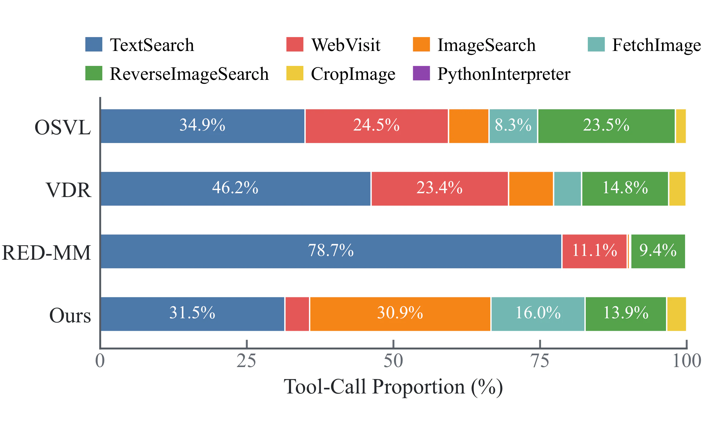
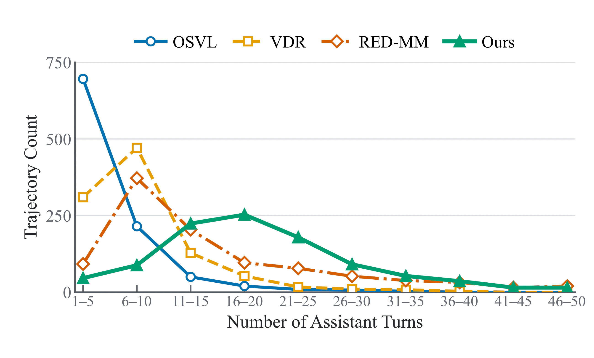

<div align="center">

# DeepVoyager-VL

### Incentivizing Vision-in-the-Loop Search for Long-Horizon Multimodal Agents

The official repository for **DeepVoyager-VL**, a long-horizon multimodal
deep-search framework in which newly acquired visual evidence determines what
the agent searches next.

[](https://arxiv.org/abs/2608.01827)
[](https://halcyon-zhang.github.io/DeepVoyager-VL/)
[](LICENSE)

<p>
  <a href="https://huggingface.co/datasets/Halcyon-Zhang/EventVoyage-VL">
    🤗 <b>EventVoyage-VL Dataset</b>
  </a>
</p>
<p>
  <a href="https://huggingface.co/Halcyon-Zhang/DeepVoyager-VL-8B">
    🤗 <b>DeepVoyager-VL-8B</b>
  </a>
  &nbsp;&nbsp; | &nbsp;&nbsp;
  <a href="https://huggingface.co/Halcyon-Zhang/DeepVoyager-VL-30B-A3B">
    🤗 <b>DeepVoyager-VL-30B-A3B</b>
  </a>
</p>

</div>

## News

- **[2026/08/03]** We released the [DeepVoyager-VL paper](https://arxiv.org/abs/2608.01827), [project page](https://halcyon-zhang.github.io/DeepVoyager-VL/), and the reproducible Megatron SFT training bundle.

## Highlights

- **Vision in the loop.** Visual evidence acquired during search resolves
  intermediate variables and directly drives later retrieval actions.
- **EventVoyage-VL.** A structure-before-language synthesis pipeline built on a
  visually enriched multimodal event graph creates long-horizon questions with
  explicit intermediate visual dependencies.
- **Active visual acquisition.** The agent separates image discovery from
  observation, loading or cropping only the evidence needed at each step.
- **SFT only.** DeepVoyager-VL learns long-horizon search behavior from curated
  trajectories without an additional reinforcement-learning stage.
- **Strong multimodal search performance.** DeepVoyager-VL is evaluated across
  ten multimodal information-seeking benchmarks.

## Overview

<p align="center">
  
</p>

<p align="center">
  <b>Figure 1.</b> Comparison of multimodal search data synthesis paradigms.
  Prior methods place vision at the input, front-load visual reasoning, or add
  visual evidence near the answer. EventVoyage-VL instead constructs explicit
  vision-in-the-loop dependencies throughout a long-horizon reasoning chain.
</p>

<p align="center">
  
</p>

<p align="center">
  <b>Figure 2.</b> DeepVoyager-VL covers multimodal event-graph construction,
  VQA synthesis, difficulty stratification, trajectory extraction, and
  supervised agent training.
</p>

## Performance

DeepVoyager-VL-8B and DeepVoyager-VL-30B-A3B achieve average scores of **54.8**
and **58.6** across ten benchmarks, leading scale-matched open multimodal
deep-search agents on eight and nine benchmarks, respectively.

| Model | MMSearch | SimpleVQA | LiveVQA | FVQA | BC-VL | MM-BC | MMSearch+ | VDR | BC-V³ | VisBrowse | Avg. |
| --- | ---: | ---: | ---: | ---: | ---: | ---: | ---: | ---: | ---: | ---: | ---: |
| Qwen3-VL-8B-Instruct (Agentic) | 61.7 | 60.0 | 67.7 | 69.7 | 34.6 | 5.8 | 13.5 | 16.8 | 7.7 | 15.4 | 35.3 |
| **DeepVoyager-VL-8B** | **72.7** | **76.3** | **82.7** | **82.7** | **58.4** | **24.0** | **37.1** | **35.0** | **32.3** | **47.3** | **54.8** |
| Qwen3-VL-30B-A3B-Instruct (Agentic) | 64.7 | 71.0 | 73.3 | 72.3 | 41.6 | 9.9 | 17.7 | 21.6 | 11.3 | 23.1 | 40.7 |
| **DeepVoyager-VL-30B-A3B** | **74.0** | **81.0** | **82.7** | **84.7** | **64.2** | **30.5** | **40.6** | **39.4** | **35.0** | **53.8** | **58.6** |

See the [paper](https://arxiv.org/abs/2608.01827) and
[project page](https://halcyon-zhang.github.io/DeepVoyager-VL/) for complete
baseline comparisons and ablation studies.

## Trajectory Analysis

<table>
  <tr>
    <td width="50%"></td>
    <td width="50%"></td>
  </tr>
  <tr>
    <td align="center"><b>(a) Visual tool engagement</b></td>
    <td align="center"><b>(b) Interaction horizon</b></td>
  </tr>
</table>

Under unified rollouts, visual tools account for **64.3%** of EventVoyage-VL
tool calls, compared with 40.6%, 30.3%, and 10.1% for three public datasets.
EventVoyage-VL trajectories peak at **16–20 turns**, while the compared datasets
peak within 1–10 turns.

## Repository Structure

```text
DeepVoyager-VL/
├── Megatron-LM/       # Megatron-Core distributed training
├── ms-swift/          # Model, template, data encoding, and SFT integration
├── mbridge/           # Hugging Face ↔ Megatron checkpoint bridge
├── configs/           # Sanitized 8B and 30B-A3B training examples
├── scripts/           # Installation, training, Docker, and multi-node launchers
├── webpage/           # Statically exportable project page
└── hosts.example      # Example multi-node host list
```

The repository intentionally excludes training samples, model weights,
checkpoints, logs, caches, host addresses, and credentials. Model, dataset,
cache, and output paths must point to storage outside this repository.

## Quickstart

### 1. Clone and install

Prepare a CUDA-enabled PyTorch environment with compatible Transformer Engine
and FlashAttention versions:

```bash
git clone https://github.com/Halcyon-Zhang/DeepVoyager-VL.git
cd DeepVoyager-VL
bash scripts/install_bundled.sh
```

The bundled stack contains:

| Component | Version |
| --- | --- |
| ms-swift | `3.12.0.dev0` |
| Megatron-Core | `0.14.0rc7` |
| mbridge | `0.15.1` |

### 2. Prepare training data

Training data must be provided externally in JSONL format. Each line follows:

```json
{
  "messages": [
    {"role": "system", "content": "..."},
    {"role": "user", "content": "<image>..."},
    {"role": "assistant", "content": "<think>...</think><answer>...</answer>"}
  ],
  "images": ["/absolute/path/to/image.jpg"]
}
```

With the default loss configuration, assistant reasoning, tool calls, and
answers contribute to the loss. System, user, tool-response, and image tokens
are conditioning context.

### 3. Configure the model

For Qwen3-VL-8B:

```bash
cp configs/sft_8b.env.example configs/sft.env
```

For Qwen3-VL-30B-A3B:

```bash
cp configs/sft_30b_moe.env.example configs/sft.env
```

Edit the required external paths:

```bash
vi configs/sft.env
```

```text
MODEL_PATH=/path/to/model
DATASET=/path/to/train.jsonl
OUTPUT_DIR=/path/to/output
CACHE_ROOT=/path/to/cache
```

Load the configuration:

```bash
set -a
source configs/sft.env
set +a
```

### 4. Smoke test and train

Always run a one-step smoke test before a full training job:

```bash
MAX_STEPS=1 SAVE_STEPS=1000000 bash scripts/train_sft.sh
```

After verifying initialization, forward/backward passes, and clean process
exit, start the full run:

```bash
bash scripts/train_sft.sh
```

### 5. Multi-node training

The repository must be available at the same absolute path on every node or
through a shared filesystem.

```bash
cp hosts.example hosts.txt
vi hosts.txt

LAUNCH_MODE=local bash scripts/launch_multinode.sh hosts.txt
```

The first entry in `hosts.txt` is used as the rendezvous master. The launcher
derives `NNODES`, `NODE_RANK`, and `MASTER_ADDR` automatically.

### 6. Docker runtime

To use an existing image containing a compatible `megatron sft` command:

```bash
export IMAGE=<your-training-image>
bash scripts/docker_run.sh
```

Docker defaults to `SWIFT_RUNTIME=installed`. Use
`SWIFT_RUNTIME=bundled` only when the image dependencies are compatible with
the bundled source. If JSONL image paths lie outside the model or dataset
directory, set `MEDIA_ROOT` to their common parent.

## Default Training Configuration

| Setting | Default |
| --- | --- |
| Epochs | 4 |
| Maximum sequence length | 131,072 |
| Global batch size | 64 |
| Learning rate | `2e-5` |
| Tensor / context / pipeline parallelism | `4 / 2 / 1` |
| Expert parallelism (30B-A3B) | 8 |
| Vision encoder / aligner | Frozen |
| Packing | Enabled |
| Reporting | TensorBoard |

The scripts preserve three stability changes used in the original training
workspace: rank-local packing, communication-group warm-up, and skipping the
singleton pipeline-parallel broadcast when `PP=1`.

Two runtime modes are supported:

- `SWIFT_RUNTIME=bundled` uses the source trees in this repository.
- `SWIFT_RUNTIME=installed` uses a compatible `megatron` CLI already installed
  in the environment or Docker image.

Do not interchange optimizer states between different runtime stacks without
first validating compatibility.

## Project Page

The website is a statically exportable Next.js application:

```bash
cd webpage
npm ci
npm run dev -- --port 3001
```

Open [http://localhost:3001](http://localhost:3001). See
[`webpage/README.md`](webpage/README.md) for static export and GitHub Pages
deployment instructions.

## Citation

```bibtex
@misc{zhang2026deepvoyagervl,
  title         = {DeepVoyager-VL: Incentivizing Vision-in-the-Loop Search for Long-Horizon Multimodal Agents},
  author        = {Huanyao Zhang and Jiepeng Zhou and Runhao Zhao and Yanzhe Shan
                   and Jiaoyang Chen and Bowen Zhou and Bo Li and Fang Wang
                   and Jialong Wu and Zhengwei Tao and Lang Mei and Xiaohan Yu
                   and Liyan Liu and Chong Chen and Wentao Zhang},
  year          = {2026},
  eprint        = {2608.01827},
  archivePrefix = {arXiv},
  primaryClass  = {cs.CV},
  url           = {https://arxiv.org/abs/2608.01827}
}
```

## Acknowledgements

This repository builds on
[Qwen3-VL](https://github.com/QwenLM/Qwen3-VL),
[ms-swift](https://github.com/modelscope/ms-swift),
[Megatron-LM](https://github.com/NVIDIA/Megatron-LM), and
[mbridge](https://github.com/ISEEKYAN/mbridge).

## License

This project is released under the [MIT License](LICENSE).
